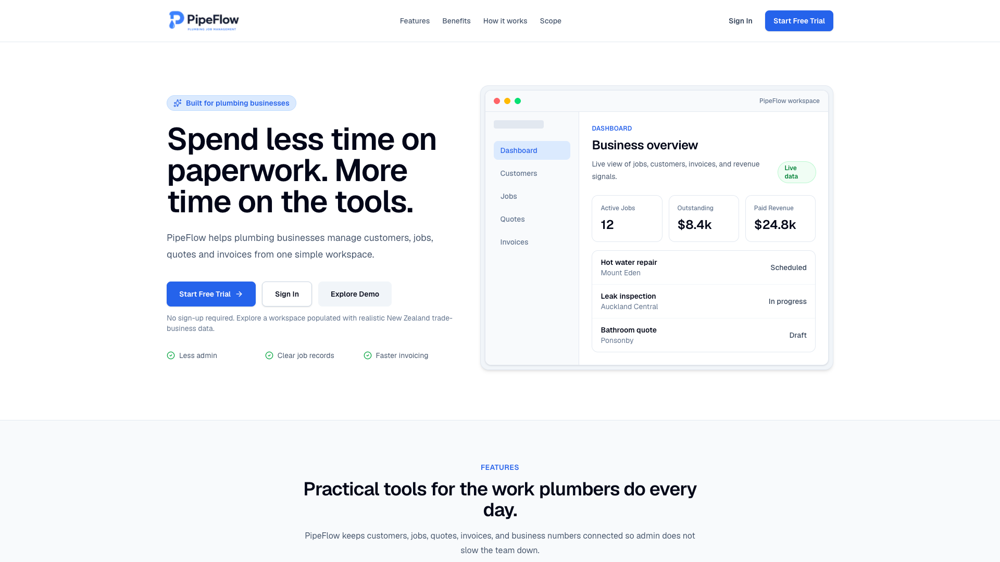
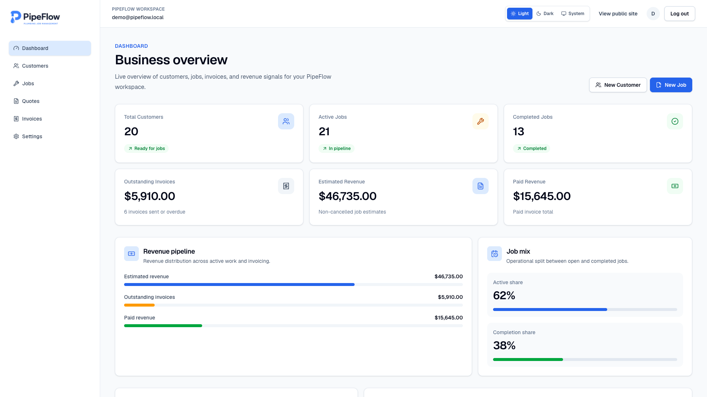
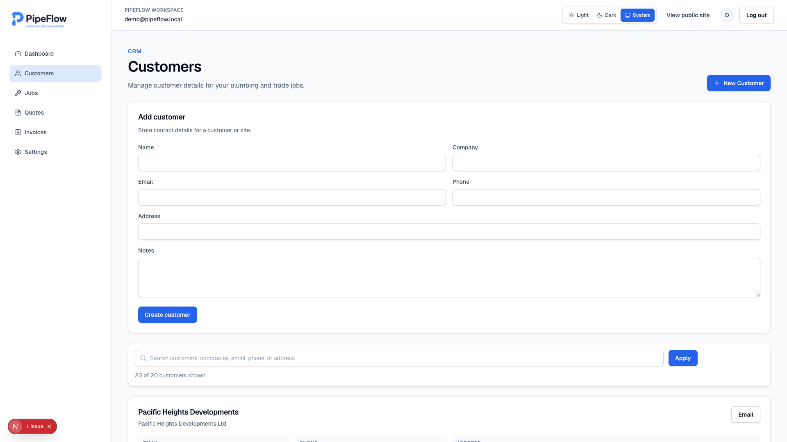
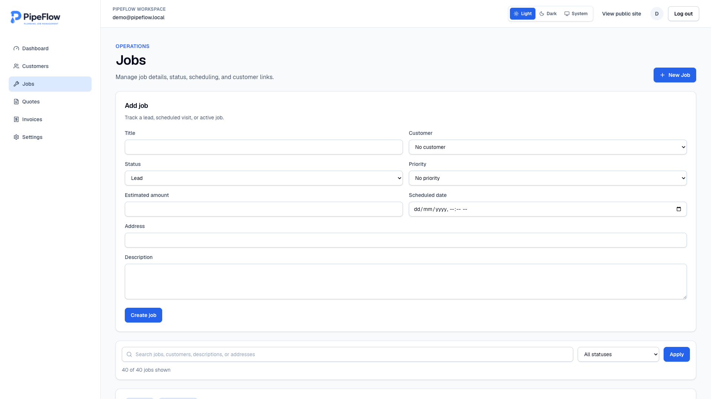
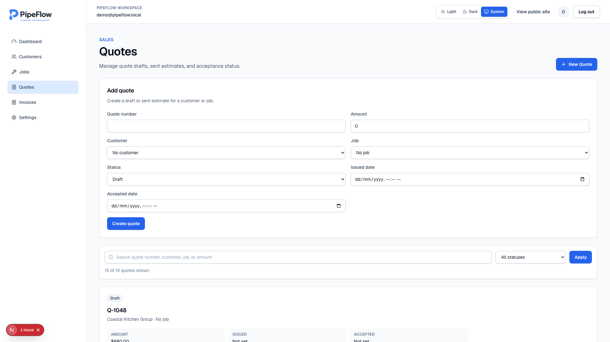
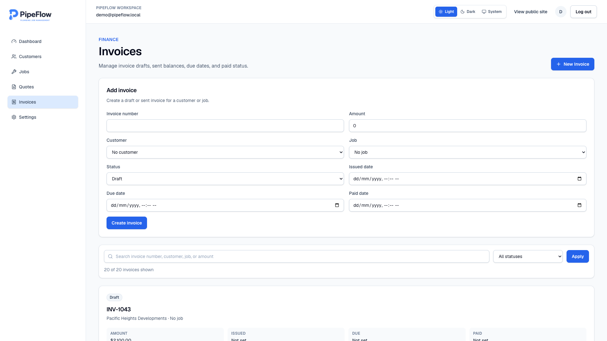

# PipeFlow


PipeFlow is a portfolio SaaS application for small trade businesses in New Zealand. It helps owner-operated plumbing and field service teams manage customers, jobs, quotes, invoices, and dashboard metrics from a protected workspace.

The project demonstrates production-ready architecture for a modern business application: authenticated routes, Supabase-backed CRUD workflows, PostgreSQL Row Level Security, Server Components, Server Actions, validation, and focused tests.

Built around realistic workflows used by plumbing, electrical, HVAC, and other field service businesses in New Zealand.

## Live Demo

[](https://pipeflow.sonpeter.com/demo)

Click **Explore Demo** to open a workspace populated with realistic New Zealand trade-business data. No sign-up required.

## Screenshots

### Landing



### Dashboard



### Customers



### Jobs



### Quotes



### Invoices



## Why I Built This

Small trade teams often manage customer notes, job status, quote follow-up, and invoices across disconnected tools. PipeFlow shows how I would design and build a focused operational SaaS MVP for that workflow.

The goal is not just to show CRUD screens. The app is structured around the kind of secure, maintainable, client-facing product foundation a real service business could build on.

## Architecture

```text
Browser
    │
    ▼
Next.js 16 (App Router)
    │
    ▼
Server Actions
    │
    ▼
Supabase Auth
    │
    ▼
PostgreSQL Database
    │
    ▼
Row Level Security (RLS)
```

PipeFlow uses a modern Next.js App Router architecture with Server Actions for secure mutations. Authentication is handled by Supabase Auth, while PostgreSQL and Row Level Security (RLS) ensure each user can only access their own workspace data.

## Tech Stack

- Next.js 16 App Router
- React 19
- TypeScript
- Tailwind CSS
- Supabase Auth
- Supabase Postgres with Row Level Security
- Server Components and Server Actions
- Zod validation
- Vitest, React Testing Library, Playwright, and jsdom
- pnpm

## Features

- Secure authentication with Supabase
- Customer management
- Job tracking
- Quote management
- Invoice management
- Dashboard analytics
- Responsive UI
- One-click demo workspace

## Implementation Highlights

- `app/` contains the Next.js App Router pages, layouts, and Server Actions.
- `app/dashboard/*` contains the authenticated SaaS workspace.
- `app/dashboard/settings/actions.ts` persists workspace profile changes through Supabase.
- `lib/*/validation.ts` contains Zod schemas for form-backed resources.
- `lib/dashboard/metrics.ts` calculates dashboard metrics from Supabase rows.
- `lib/supabase/` contains browser, server, and proxy Supabase clients.
- `supabase/migrations/001_initial_schema.sql` defines the database schema, indexes, triggers, and RLS policies.
- `supabase/seed.sql` provides realistic New Zealand trade business demo data.

## Database & Security

The Supabase migration creates:

- `profiles`
- `customers`
- `jobs`
- `quotes`
- `invoices`
- indexes for common dashboard queries
- `updated_at` triggers
- RLS policies scoped to `auth.uid()`

No service role key is required for the implemented app flows. Authenticated users can only access records that belong to their own workspace.

## Local Setup

Install dependencies:

```bash
pnpm install
```

Create a local environment file:

```bash
cp .env.example .env.local
```

Fill in `.env.local` with values from your Supabase project:

```bash
NEXT_PUBLIC_SUPABASE_URL=your-project-url
NEXT_PUBLIC_SUPABASE_ANON_KEY=your-anon-key
DEMO_USER_EMAIL=demo@pipeflow.local
DEMO_USER_PASSWORD=your-demo-password
```

Do not commit real Supabase secrets.

Run the app:

```bash
pnpm dev
```

Open [http://localhost:3000](http://localhost:3000).

## Supabase Setup

1. Create a Supabase project.
2. Copy the project URL and anon key into `.env.local`.
3. Apply the migration in `supabase/migrations/001_initial_schema.sql`.
4. Confirm email/password auth is enabled in Supabase Auth.
5. Start the Next.js dev server with `pnpm dev`.

If you use the Supabase CLI, run the migration through your normal local database flow. Otherwise, paste the SQL migration into the Supabase SQL editor for a demo project.

To load realistic demo data, create a demo user through the app signup flow, then run `supabase/seed.sql` in the Supabase SQL editor.

## Portfolio Demo Setup

For a hosted portfolio demo:

1. Create a dedicated Supabase Auth user, for example `demo@pipeflow.local`.
2. Use a strong password and store it only in deployment environment variables.
3. Copy the demo user's Supabase Auth ID for your own records.
4. Run `supabase/seed.sql` so the demo records belong to that user.
5. Set `DEMO_USER_EMAIL` in the local or deployment environment.
6. Set `DEMO_USER_PASSWORD` in the local or deployment environment.
7. Restart the dev server or redeploy the application.
8. Open `/demo` (or click **Explore Demo** in the README / landing page) and confirm it lands on `/dashboard`.

Do not commit the demo password, Supabase project identifiers, or private environment values.

## Commands

```bash
pnpm dev      # start local development
pnpm build    # create a production build
pnpm start    # run the production build
pnpm lint     # run ESLint
pnpm test     # run Vitest tests
pnpm test:e2e # run Playwright smoke tests
```

## Testing

Tests are intentionally focused and lightweight for a portfolio SaaS project. They cover shared utilities, form validation, dashboard metric calculations, and an auth/dashboard smoke flow.

```bash
pnpm test
pnpm test:e2e
```

Current verification:

- `pnpm test`
- `pnpm test:e2e`
- `pnpm lint`
- `pnpm build`

## Deployment

This app is ready for Vercel-style deployment:

1. Create a hosted Supabase project.
2. Apply the SQL migration.
3. Add `NEXT_PUBLIC_SUPABASE_URL` and `NEXT_PUBLIC_SUPABASE_ANON_KEY` to the deployment environment.
4. Add `DEMO_USER_EMAIL` and `DEMO_USER_PASSWORD` if the hosted demo CTA should be enabled.
5. Deploy the Next.js app.

## Portfolio Purpose

PipeFlow was built as a production-style portfolio project to demonstrate how I design and develop modern business applications using Next.js, React, TypeScript, and Supabase. It reflects the architecture, development practices, and user experience I bring to real client projects.

## What this project demonstrates

This project showcases modern SaaS application development practices, including:

- Modern Next.js App Router architecture
- Secure authentication with Supabase Auth
- Row Level Security (RLS)
- Server Actions
- Full CRUD workflows
- Responsive dashboard UI
- Form validation with Zod
- Reusable component architecture
- Automated testing with Vitest
- Production-focused development workflow

## License

This project is provided for portfolio and demonstration purposes.

You are welcome to explore the source code for learning and evaluation. Redistribution or commercial reuse of the project or its assets is not permitted without prior permission.